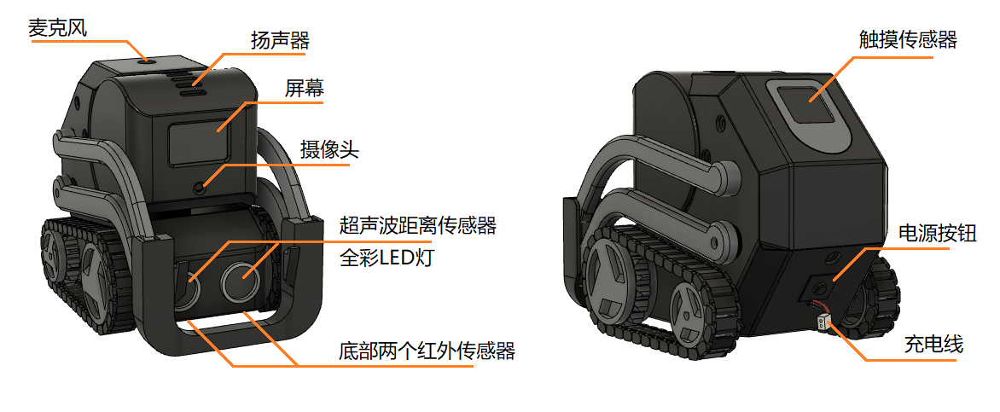

机器人的设置
===================

电源
--------

* 充电

    机器人背后露出的一对红黑线便是充电线，连接充电器时红灯亮表示正在充电，当充电器的灯变绿时表示已经充满。如果出现无法开机、无故重启、连接异常等问题，很可能是电量不足造成的，充电后再试试。建议每次使用前先充满电，这样保证一次能够使用较长时间

* 开机

    按下机器人背后靠下的黑色 **电源按钮**，如果头部内的黄灯亮着则表示 Cozmars 已经启动，**启动过程需要大约一分钟**，直到“嘀”的一声，启动完毕。这时如果轻触背部的触摸传感器，屏幕上会出现 Cozmars 的 *四位序列号*

* 关机

    长按触摸传感器约 5 秒后，听到“嘀～”的一声即是关机，等待头部内的黄色灯熄灭后再按一下电源键，断开电源。

..
    而魔方的开/关机就简单多了，开机时按下黑色电源键，如果要关机就再按一次就是了。

.. note::

    由于 Cozmars 机器人是由树莓派 zero w 控制，运行的是 raspbian 操作系统，就像电脑一样，关机时最好先关闭操作系统后再断电

..
    ；而魔方是由 ESP8266 单片机控制，关机就不用那么讲究啦

wifi 设置
-----------

启动后点击顶部的按钮，屏幕上会显示机器人的四位数序列号。

第一次启动时由于还没设置 wifi，它默认会提供一个名为 :data:`rcute-cozmars-xxxx` 的 wifi 热点，其中 :data:`xxxx` 是 Cozmars 的序列号。连接这个 wifi 热点，输入密码 :data:`xxxxxxxx` (即两遍序列号)，然后用浏览器访问 :data:`http://rcute-cozmars-xxxx.local`，点击 :data:`wifi 设置` 按钮，输入家里或办公环境的 wifi 名和密码，点击保存。重启网络后机器人即可自动连接刚刚设置的 wifi。

..
    * 魔方

        和 Cozmars 类似，如果未设置 wifi，魔方在启动时会提供一个名为 :data:`rcute-cube-****` 的 wifi 热点，这里 :data:`****` 是魔方的序列号（不同于 Cozmars 的序列号），连接 wifi 热点后，输入 :data:`********` 两遍序列号作为密码，然后访问 :data:`http://rcute-cube-****.local` 可以进行 wifi 设置。

    每次启动时 Cozmars 和魔方都会先尝试连接设置好的 wifi，如果无法连接则会提供默认的 wifi 热点。

每次启动时 Cozmars 会先尝试连接设置好的 wifi，如果无法连接则会提供默认的 wifi 热点。

固件升级
----------------

..
    Cozmars 和魔方的固件更新都通过网络推送，在联网时用浏览器访问 Cozmars 的页面 :data:`http://rcute-cozmars-xxxx.local` 或 魔方的页面 :data:`http://rcute-cube-****.local` ，当出现 :data:`更新` 按钮时表示有新版本的固件，点击按钮即可更新固件

Cozmars 的固件更新都通过网络推送，在联网时用浏览器访问 Cozmars 的页面 :data:`http://rcute-cozmars-xxxx.local` ，当出现 :data:`更新` 按钮时表示有新版本的固件，点击按钮即可更新固件

舵机调试
----------
Cozmars 机器人的头部和左、右手臂分别是由三个舵机驱动的，当头部或手臂无法运动到指定位置，或者左右手臂不同步时，可以访问 :data:`http://rcute-cozmars-xxxx.local` 页面，点击 :data:`舵机调试` 按钮进行调试

（。。。未完待续。。。）

马达调试
----------
Cozmars 机器人的左、右轮子由两个马达驱动，当 Cozmars 前进或后退无法走直线时，可以访问 :data:`http://rcute-cozmars-xxxx.local` 页面，点击 :data:`马达调试` 按钮进行调试

（。。。未完待续。。。）