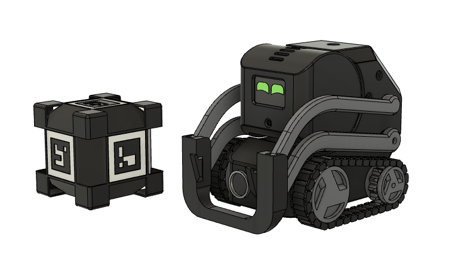

欢迎阅读 rcute-cozmars 的文档！
=========================================

rcute-cozmars 是3d打印教育机器人 Cozmars 的 Python SDK，实现对机器人的基本控制，并可以结合 `rcute-ai <https://rcute-ai.readthedocs.io>`_ 完成图像/语音识别等功能

`Installation instructions in English <https://github.com/r-cute/rcute-cozmars/blob/master/README.md>`_

`视频 Demo <https://www.bilibili.com/video/BV11v411H7HE?share_source=copy_web>`_

---------

.. toctree::
   :maxdepth: 2

   prepare
   examples/index
   async

.. toctree::
   :maxdepth: 1

   api/index

-----------------------

欢迎提问或反馈bug到 https://github.com/r-cute/rcute-cozmars/issues

..
	相关资料
	++++++++++++++++

	* 3d 模型（V1）： https://www.thingiverse.com/thing:4657644
	* 固件： https://github.com/r-cute/rcute-cozmars-server

	DIY 爱好者可根据开源资料自己制作、使用

	.. warning::

	    他人禁止售卖该机器人的模型打印件、成品或其改装

	-------------

	* :ref:`genindex`
	* :ref:`search`
